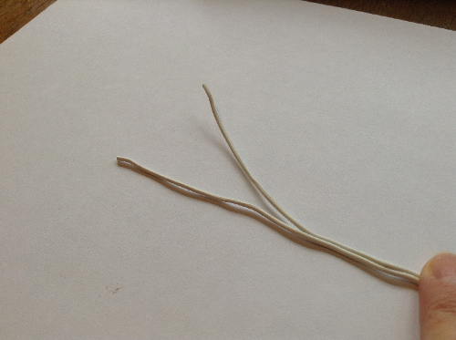
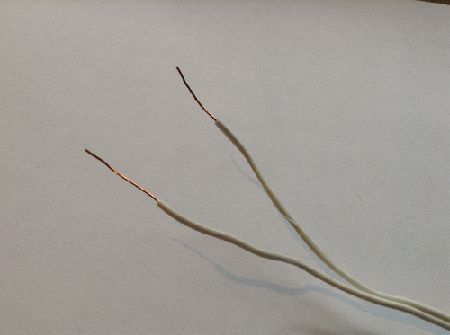
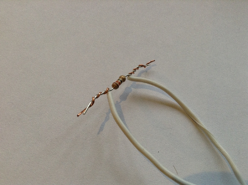
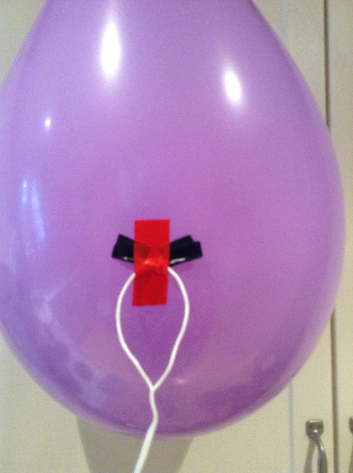

## Set up the balloon popper

You will use a resistor to make the balloon pop.

--- collapse ---

---

title: What are resistors

---

Resistors are electrical components that reduce the current flowing around a circuit, and in doing so they sometimes get hot. You're going to take advantage of this heat and deliberately overheat a resistor to pop a balloon.

--- /collapse ---

--- task ---

Inflate a balloon so it's nice and full, then tie a knot in it.

--- /task ---

--- task ---

Take the speaker cable (about 2 meters in length) and strip both ends, so the bare wire is visible.

--- /task ---

--- task ---

Take a 12Ω resistor. 

(The 330Ω resistor looks like this for comparison.)

Twist one wire of the cable around one leg coming from the 12Ω resistor, and the other wire around the other leg. It doesn't matter which wire is connected to which leg, just make sure the two ends of the wire do not touch each other.

Make sure that there's a firm connection — you could wrap electrical tape around the twisted wire to ensure it stays in place.

--- /task ---

--- task ---

Take some more electrical tape (it doesn't matter what colour you use) and tape the resistor firmly onto the most stretched part of the balloon — that's the balloon's side, as in the picture below. It's important that this resistor is firmly touching the balloon, so stick it on carefully.

Now tie some string onto the knot of your balloon and put it in a safe place so it won't hurt anyone when it pops. You can stick it somewhere using tape or Blu-Tack.

--- /task ---

