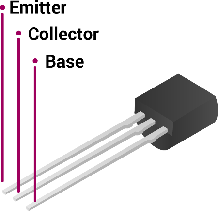
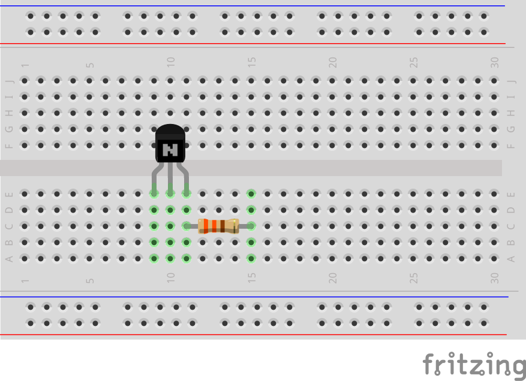
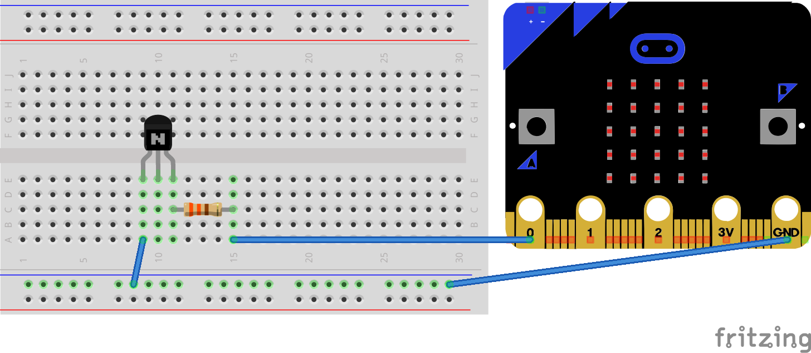
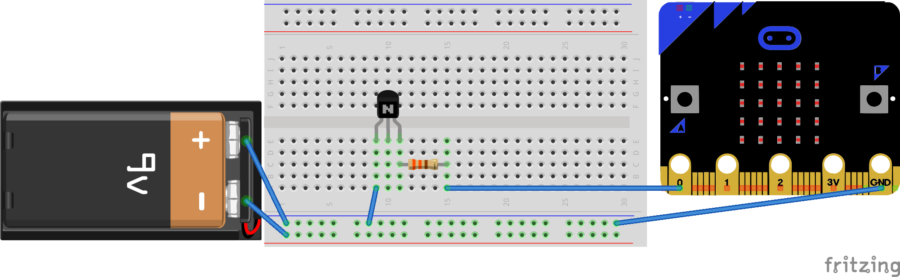

## Connect the transistor

--- collapse ---

---

title: Transistors

---

The voltage of a circuit is the amount of 'push' the current has: a higher voltage provides a bigger push, which usually results in more current flowing in the circuit. Here, to make the resistor hot enough to pop the balloon, you need to run a higher current through the resistor than the voltage on the micro:bit can provide. To do this, you will use a device called a transistor.

A transistor allows you to 'amplify' a circuit, as they can be switched 'on' by a low-voltage circuit, and once 'on' they allow a higher voltage circuit to flow. However, it's important that they're wired up correctly.

Hold your transistor up and you'll see that it's a semi-circular shape, with three pins coming out the bottom. Each of these pins has a different name and role.

The base controls the transistor and if it receives a signal (a small voltage), it turns the transistor 'on', allowing current from a higher voltage circuit to flow between the collector and the emitter.

**Note: Some models of transistors have the pins in a different order. If you're using transistors that are not BC635 transistors, then you must look at the datasheet to check that your wiring is correct. Incorrect wiring could damage your micro:bit or the transistor, or make your balloon pop too early!**

--- /collapse ---

--- task ---

Hold the BC635 transistor with the flat side facing towards you. From left to right, the pins are called the emitter, the collector, and the base.

--- /task ---

--- task ---

Carefully place the transistor onto the breadboard, with the flat side facing the ground rail and a 330Ω resistor connected to the base, like so:

Be sure to place one pin in each hole in the same row.

--- /task ---

--- task ---

Now use a pin-to-pin jumper cable to connect the emitter to the ground rail, and a crocodile clip to connect the unconnected end of the 330Ω resistor to Pin 0 on the micro:bit.

--- /task ---

--- task ---

Connect the battery snap to the 9V battery and connect the red cable to the positive rail and the black cable to the ground rail.

--- /task ---

**Tip:** You need 9 volts for the resistor to get hot enough to pop the balloon!
