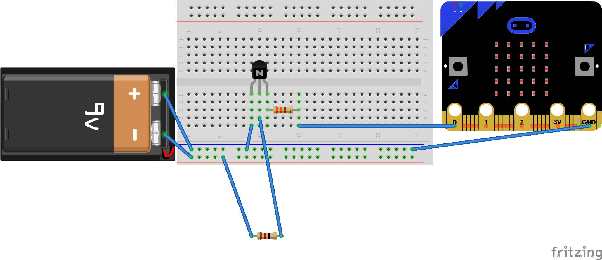

## Connect the balloon

--- task ---

The circuit must go through the resistor attached to the balloon. Connect one end of the 12Ω resistor to the transistor's collector (the middle leg) and the other side to the 9V power rail:

--- /task ---

The circuit is now complete. When triggered, the current will flow from the battery, through the resistor to the collector pin of the transistor, out the emitter pin, and then back to ground. As the current flows through the resistor, it will heat it up so much that the balloon will pop.

